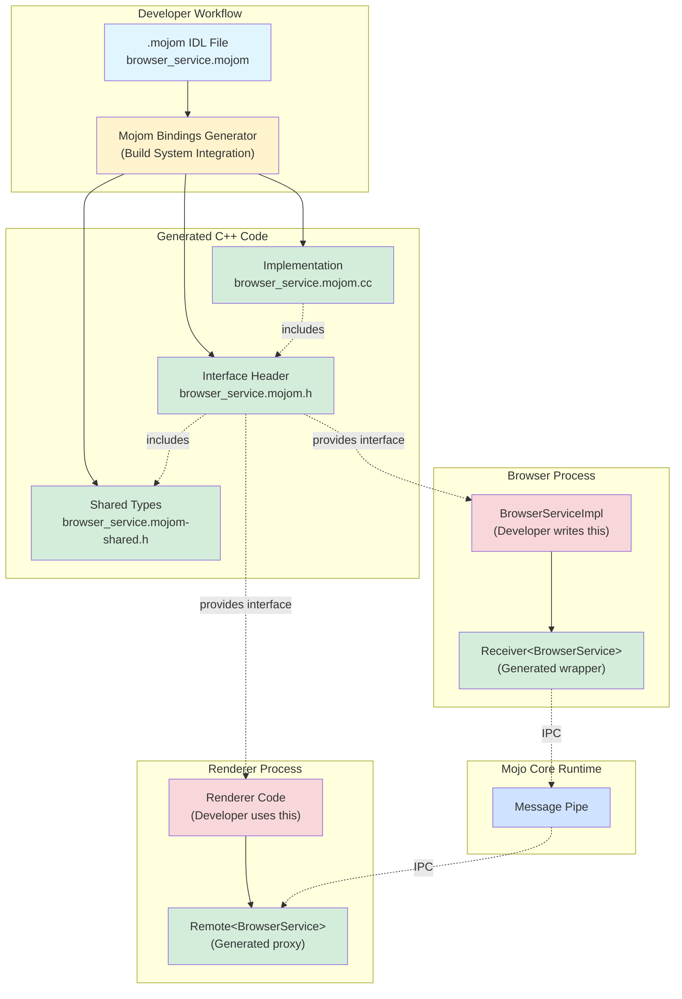
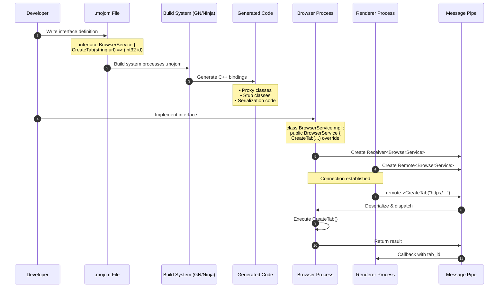
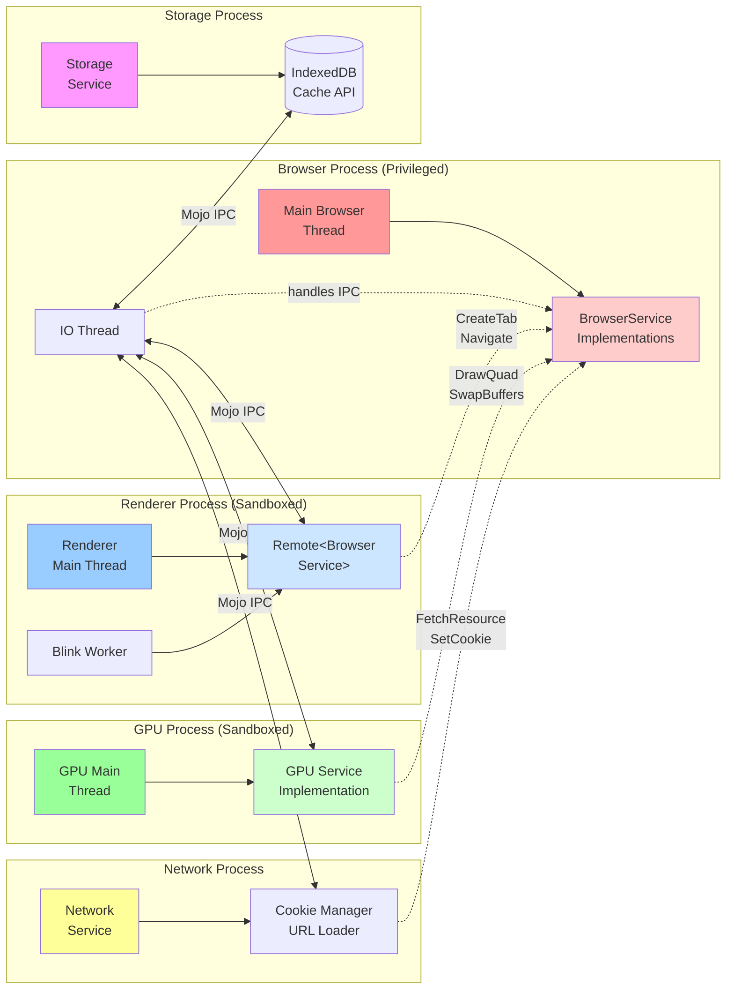
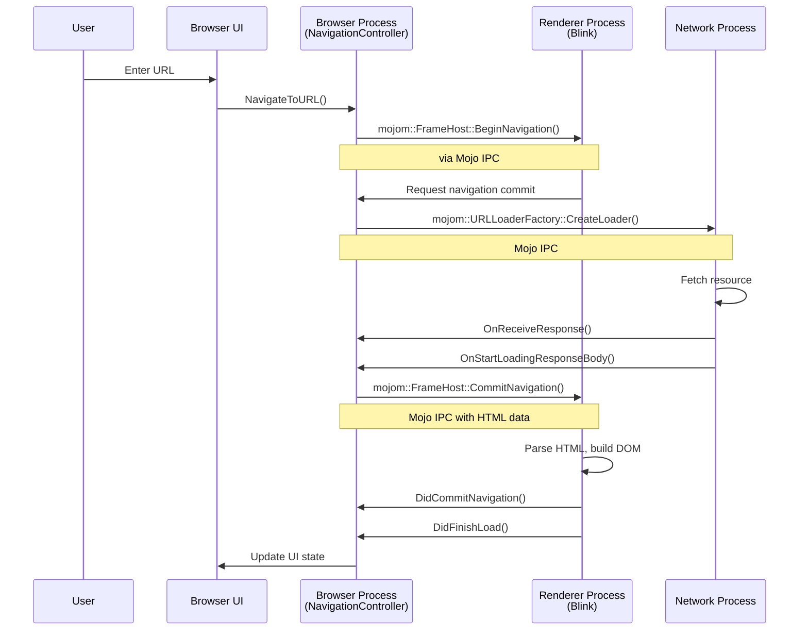

# 🧭 Chromium IPC Demonstrations

This repository contains practical examples demonstrating **Chromium-style Mojo IPC** and **Chrome DevTools Protocol (CDP)** for interprocess communication.

💡 This project idea was inspired by [the article about Atlas](https://openai.com/index/building-chatgpt-atlas/) published by OpenAI.

## 📋 Overview

### 🔗 What is Mojo IPC?

Mojo is Chromium's inter-process communication (IPC) system that enables communication between different processes (browser, renderer, GPU, etc.). It uses:
- 📡 **Message pipes** for bidirectional communication
- 📝 **IDL (Interface Definition Language)** via .mojom files
- 🔒 **Type-safe interfaces** with automatic code generation
- ⚡ **Asynchronous message passing**

#### 🎯 Why Mojo?

**Problem it solves:**
- Traditional IPC (like named pipes, sockets) requires manual serialization/deserialization
- No type safety - easy to introduce bugs with mismatched data types
- Difficult to version and maintain as APIs evolve
- Security vulnerabilities from parsing untrusted data

**Mojo advantages:**
- ✅ **Type safety** - Compile-time checking prevents type mismatches
- ✅ **Performance** - Zero-copy message passing when possible
- ✅ **Security** - Sandboxed processes with capability-based security
- ✅ **Versioning** - Supports backward/forward compatibility
- ✅ **Cross-language** - Works across C++, Java (Android), JavaScript (Blink)

#### 📐 Mojo IDL Syntax (.mojom)

**Basic Structure:**
```mojom
module my_app.mojom;  // Namespace declaration

// Enums
enum Status {
  SUCCESS,
  FAILURE,
  PENDING
};

// Structs (data objects)
struct User {
  int32 id;
  string name;
  string email;
};

// Interfaces (services)
interface UserService {
  // Synchronous-style (with callback)
  GetUser(int32 user_id) => (User user, Status status);
  
  // One-way message (no response)
  LogEvent(string event);
  
  // Multiple parameters
  UpdateUser(int32 user_id, string name) => (bool success);
};
```

**Common Types:**
- `bool` - Boolean
- `int8`, `uint8`, `int16`, `uint16`, `int32`, `uint32`, `int64`, `uint64` - Integers
- `float`, `double` - Floating point
- `string` - UTF-8 string
- `array<T>` - Array of type T
- `map<K, V>` - Map/dictionary
- `T?` - Nullable/optional type
- `pending_remote<Interface>` - Remote interface handle
- `pending_receiver<Interface>` - Receiver interface handle

**Real Chromium Example:**
```mojom
// From Chromium's storage/browser/quota/quota_manager.mojom
interface QuotaManager {
  GetUsageAndQuota(url.mojom.Origin origin) 
    => (int64 usage, int64 quota, bool is_quota_exceeded);
  
  RequestQuota(url.mojom.Origin origin, int64 requested_quota)
    => (int64 granted_quota);
};
```

#### 🕐 When to Use Mojo?

**Use Mojo when:**
- 🏢 **Multi-process architecture** - Need communication between isolated processes
- 🔐 **Security matters** - Sandboxing untrusted code (e.g., renderer processes)
- ⚡ **Performance critical** - High-frequency IPC with low overhead
- 🔄 **Complex APIs** - Many methods with structured data
- 🌐 **Cross-language** - Need to call between C++, JavaScript, Java

**Don't use Mojo when:**
- 📝 Single-process application
- 🔧 Simple debugging/tooling (use CDP instead)
- 🌍 External clients need access (use REST/gRPC/CDP)
- 🚀 Prototyping without Chromium infrastructure

**Real-world Chromium usage:**
- Browser ↔ Renderer: DOM operations, navigation, resource loading
- Browser ↔ GPU: Graphics commands, texture management
- Browser ↔ Network Service: HTTP requests, cookie management
- Browser ↔ Storage Service: IndexedDB, Cache API, Quota
- Browser ↔ Audio Service: Audio playback, recording

### 🛠️ What is Chrome DevTools Protocol (CDP)?

CDP is a protocol that allows tools to instrument, inspect, debug and profile Chromium-based browsers. It provides:
- 🔌 **WebSocket-based communication**
- 📦 **JSON-RPC style messages**
- 🐛 **Remote debugging capabilities**
- 🎯 **Target (tab/page) management**

## 💻 Examples

### 1. 🐍 CDP Example (Python)
**File:** `cdp_example.py`

Demonstrates connecting to Chrome via CDP and managing browser targets.

**Usage:**
```bash
pip install websockets
python cdp_example.py
```

**Features:**
- Launches Chrome with remote debugging
- Connects via WebSocket
- Creates and manages browser targets
- Sends CDP commands

### 2. 🟨 CDP Example (JavaScript/Node.js)
**File:** `cdp_example.js`

Node.js implementation of CDP communication.

**Usage:**
```bash
npm install ws
node cdp_example.js
```

**Features:**
- Same functionality as Python version
- Native JavaScript Promise handling
- WebSocket communication

### 3. 🔄 Mojo IPC Simulation
**File:** `mojo_ipc_simulation.py`

Conceptual demonstration of Mojo-style IPC using Python multiprocessing - simulates the architecture without building Chromium.

**Usage:**
```bash
python mojo_ipc_simulation.py
```

**Features:**
- Message pipe simulation
- Service/Client pattern
- Multi-process communication
- Request/response handling

### 4. 📐 Mojo IDL (.mojom) Demo
**File:** `mojom_demo.py`

Demonstrates how Mojo Interface Definition Language works by simulating the code generation process from .mojom files.

**Usage:**
```bash
python mojom_demo.py
```

**Features:**
- Simulated .mojom interface definition
- Proxy/Stub pattern (client/server)
- Type-safe interface binding
- Async callbacks
- BrowserService example (CreateTab, Navigate, etc.)

### 5. 📄 Mojo File Parser & Loader
**File:** `mojom_loader.py` + `browser_service.mojom`

**Directly parses and loads actual .mojom files** - reads real Mojo IDL syntax and generates Python bindings dynamically.

**Usage:**
```bash
python mojom_loader.py
```

**Features:**
- ✨ Parses real .mojom files (not simulation)
- 🔧 Dynamic code generation from IDL
- 🎯 Auto-generates Proxy classes
- 📋 Supports enums, interfaces, methods
- 🔄 Full parameter and return type parsing
- 💡 No Chromium build required

## 🏗️ Architecture

### Mojo in Chromium Architecture



### Mojo Code Generation Flow



### CDP Communication Flow
```
Client Process                Chrome Browser
     |                              |
     |---(WebSocket Connection)---->|
     |                              |
     |---{Target.createTarget}----->|
     |<----{targetId: "..."}--------|
     |                              |
     |---{Target.activateTarget}--->|
     |<----{success: true}----------|
```

### Mojo IPC Concept
```
Renderer Process          Browser Process
     |                         |
     |--[Message Pipe]---------|
     |                         |
     |--{CreateTab}----------->|
     |<--{tab_id}--------------|
     |                         |
     |--{Navigate}------------>|
     |<--{success}-------------|
```

### Mojo Compilation Flow
```
.mojom file
    ↓
[Build System: GN + Ninja]
    ↓
Mojom Bindings Generator
    ↓
Generated C++ binding files
    ├─ interface.mojom.h        (interface definitions)
    ├─ interface.mojom.cc       (serialization code)
    ├─ interface.mojom-shared.h (shared types)
    └─ interface.mojom-forward.h (forward declarations)
    ↓
Client creates Remote<Interface>
Server creates Receiver<Interface>
    ↓
Message Pipe connects them
    ↓
Type-safe IPC communication
```

**Note:** Chromium uses GN (Generate Ninja) as its meta-build system and Ninja as the actual build tool. The `.mojom` files are processed through the build system's mojom target rules, which invoke the bindings generator to create the C++ code.

### Chromium Process Architecture with Mojo



### Real Example: Page Navigation with Mojo



## ⚖️ Key Differences

| Feature | Mojo IPC | CDP |
|---------|----------|-----|
| **Purpose** | Internal Chromium IPC | External debugging/automation |
| **Protocol** | Binary message pipes | JSON over WebSocket |
| **Type Safety** | Strongly typed (.mojom) | JSON schema |
| **Performance** | Optimized for speed | Human-readable |
| **Access** | Requires Chromium build | Works with any Chrome |
| **Use Case** | Production IPC | Development/testing |
| **Language** | C++/Java/JS (internal) | Any language with WebSocket |
| **Security** | Process isolation | Debugging port (development only) |

## 🔄 Mojo vs Other IPC Methods

| Method | Type Safety | Performance | Complexity | Cross-Process |
|--------|-------------|-------------|------------|---------------|
| **Mojo** | ✅ Strong | ⚡ Very Fast | 🔧 Medium | ✅ Yes |
| **gRPC/Protocol Buffers** | ✅ Strong | ⚡ Fast | 🔧 Medium | ✅ Yes |
| **COM/DCOM** | ✅ Strong | 🐌 Medium | 🔧 High | ✅ Yes |
| **D-Bus** | ⚠️ Weak | 🐌 Medium | 🔧 Low | ✅ Yes |
| **Shared Memory** | ❌ None | ⚡⚡ Fastest | 🔧 High | ✅ Yes |
| **Unix Sockets** | ❌ None | 🐌 Medium | 🔧 Low | ✅ Yes |
| **REST/HTTP** | ⚠️ Medium | 🐌 Slow | 🔧 Low | ✅ Yes |

## 📦 Requirements

### 🐍 Python Examples
- Python 3.7+
- `websockets` library
- Node.js 14+
- `ws` library
- Chrome/Chromium browser

## 📝 Notes

- ✅ **No Chromium Build Required**: These examples use existing Chrome installations and simulation
- 🎯 **CDP is Production-Ready**: Can be used for real automation/testing
- 🔬 **Mojo Simulation**: Demonstrates concepts only; actual Mojo requires C++ and Chromium build
- 🎓 **Minimal Error Handling**: Focus on demonstrating core concepts

## 🌍 Real-World Use Cases

### 🛠️ CDP
- Browser automation (Puppeteer, Playwright)
- Performance monitoring
- Screenshot/PDF generation
- Network interception
- Code coverage collection

### 🔗 Mojo IPC (in Chromium)
- Renderer ↔ Browser communication
- GPU process communication
- Plugin/extension sandboxing
- Service worker management
- Network service isolation

## 📚 Further Reading

- [Chrome DevTools Protocol](https://chromedevtools.github.io/devtools-protocol/)
- [Mojo Documentation](https://chromium.googlesource.com/chromium/src/+/main/mojo/README.md)
- [Chromium Multi-process Architecture](https://www.chromium.org/developers/design-documents/multi-process-architecture/)

## 📄 License

MIT
