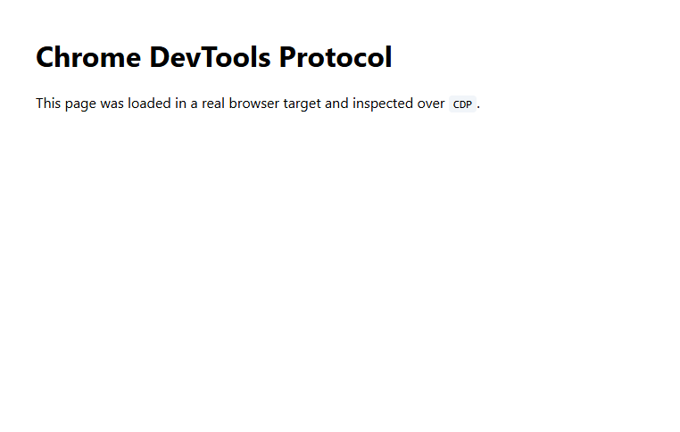

# Sample CDP Run

This sample uses `uv` to run the Python CDP client against a real Chrome or Microsoft Edge process.

## Command

```bash
uv sync
uv run python cdp_example.py
```

## Expected Output

The target ID and Chrome version will vary by machine.

```text
Connected to real browser: Chrome/148.0.7778.179
Created target: E1EB6C6E0EDC51EF2ED9ABA291A42BBF
Page title: Real CDP Target
Page URL: data:text/html;charset=utf-8,...
Observed network requests: 1
Screenshot: D:\Code\mini-chronium-mojo-ipc-cdp-protocol\cdp-screenshot.png
```

## Screenshot

The captured image below was produced by the CDP `Page.captureScreenshot` command.



## Custom URL

```bash
uv run python cdp_example.py --url https://example.com
```

## Existing Browser

Start Chrome or Edge with remote debugging enabled, fetch the browser WebSocket URL, then pass it to the client.

```bash
chrome --remote-debugging-port=9222 --user-data-dir=%TEMP%\cdp-profile
curl http://127.0.0.1:9222/json/version
uv run python cdp_example.py --browser-ws-url <webSocketDebuggerUrl from /json/version>
```
